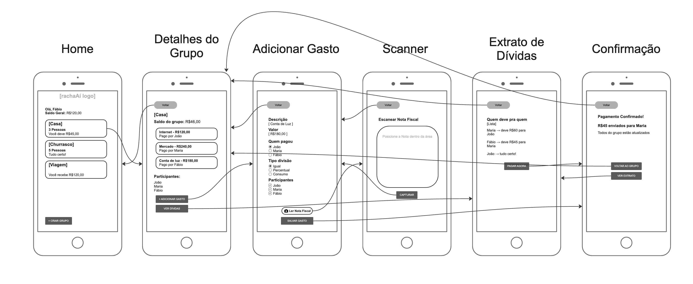

# RachaAí - Protótipo de Baixa Fidelidade

## 👥 Integrantes

- Cauã Mendes  
- Fábio Henrique Zanini Ferreira  
- Gabriel Ferreira de Souza  
- Lucas Henrique Miranda  

**Curso:** Análise e Desenvolvimento de Sistemas (ADS)  
**Instituição:** Centro Universitário UNA – Belo Horizonte  

---

## Persona

O protótipo foi desenvolvido para estudantes e jovens adultos que dividem apartamentos, repúblicas ou casas compartilhadas e possuem dificuldades para organizar despesas coletivas de forma clara e prática.

---

## Heurística de Nielsen em foco

### Visibilidade do status do sistema

O protótipo prioriza feedbacks visuais claros para reduzir dúvidas e ansiedade relacionadas ao dinheiro.

Exemplos aplicados:
- confirmação de pagamento;
- indicação de usuários pendentes;
- saldo atualizado;
- leitura da nota fiscal;
- visualização clara de dívidas.

---

## Fluxo de Tarefa

### Cadastro e divisão de uma conta de luz entre 3 pessoas

1. O usuário acessa o Dashboard de grupos.
2. Seleciona o grupo "Casa".
3. Clica em "Adicionar Gasto".
4. Escolhe a opção de leitura da nota fiscal.
5. Escaneia a nota utilizando a câmera.
6. O sistema preenche automaticamente descrição e valor.
7. O usuário seleciona os participantes da divisão.
8. O gasto é salvo no grupo.
9. O sistema atualiza automaticamente o saldo e as dívidas.

---

## Objetivo do Protótipo

O aplicativo RachaAí foi projetado para simplificar a divisão de contas em grupos, reduzindo conflitos e facilitando a visualização de quem deve para quem de maneira intuitiva e transparente.

## Protótipo

